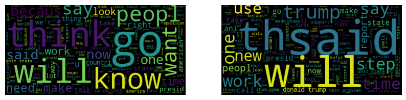

<!-- PROJECT LOGO -->
<br />
<p align="center">
  <a href="https://github.com/uf-eel6825-sp23/final-project-code-ishaansingh99/">
    
  </a>
  <h3 align="center">Identifying Patterns and Trends in Fake News</h3>
</p>


<!-- TABLE OF CONTENTS -->
<details open="open">
  <summary>Table of Contents</summary>
  <ol>
    <li>
      <a href="#about-the-project">About The Project</a>
    </li>
    <li>
      <a href="#getting-started">Getting Started</a>
      <ul>
        <li><a href="#dependencies">Dependencies</a></li>
        <li><a href="#installation">Installation</a></li>
      </ul>
    </li>
    <li><a href="#usage">Usage</a></li>
    <li><a href="#authors">Authors</a></li>
    <li><a href="#acknowledgements">Acknowledgements</a></li>
  </ol>
</details>


<!-- ABOUT THE PROJECT -->
## About The Project

This project uses the FakeNewsNet dataset to analyze fake news articles for trends and patterns, and develops machine learning models to classify them. See the [project report](Project_Report.pdf) and [code](Project_Code.ipynb) for more.

<!-- GETTING STARTED -->
## Getting Started

### Dependencies

The dataset for this project is already downloaded and available in the repository. To run the Project_Code.ipynb notebook, Python with the usual Anaconda packages are required, along with NLTK which can be installed as follows:

* Anaconda
  ```sh
  conda install anaconda
  ```
* Natural Language Toolkit
  ```sh
  conda install nltk
  ```
Also used was the python word cloud package for generating the word clouds seen in the logo above, but this is not necessary for the notebook, the cell can be skipped without any issues to the rest of the notebook:

* Natural Language Toolkit
  ```sh
  conda install wordcloud
  ```

**Alternatively**, the project repository has a requirements.yml file to clone the conda environment used to develop the code. Clone the environment as shown in the <a href="#installation">installation below</a>:

### Installation

1. Clone the repo
   ```sh
   git clone https://github.com/uf-eel6825-sp23/final-project-code-ishaansingh99.git
   ```
2. Setup (and activate) your environment (or download the packages <a href="#dependencies">above</a>)
   ```sh
   conda env create -f requirements.yml
   ```

<!-- USAGE EXAMPLES -->
## Usage

All the code for this project can be found in the commented [Project Code Jupyter Notebook](Project_Code.ipynb). Just follow the instructions above for installation.

Run every code cell in order, but you may choose to omit the word cloud and sentiment analysis cells.

A project presentation and demo can be found on [youtube here](LINK TO YOUTUBE VID).

<!-- Authors -->
## Authors

Ishaan Singh - [LinkedIn](https://www.linkedin.com/in/ishaan-singh-uflorida/) - ishaansingh@ufl.edu

Project Link: [https://github.com/uf-eel6825-sp23/final-project-code-ishaansingh99](https://github.com/uf-eel6825-sp23/final-project-code-ishaansingh99)

## Thank you
