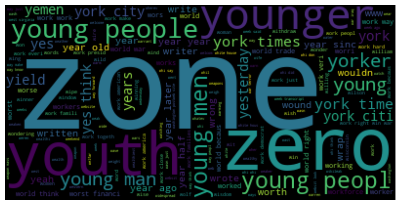

<!-- PROJECT LOGO -->
<br />
<p align="center">
  <a href="https://github.com/uf-eel6825-sp23/final-project-code-ishaansingh99/">
    
  </a>
  <h3 align="center">Identifying Patterns and Trends in Fake News</h3>
</p>


<!-- TABLE OF CONTENTS -->
<details open="open">
  <summary>Table of Contents</summary>
  <ol>
    <li>
      <a href="#about-the-project">About The Project</a>
    </li>
    <li>
      <a href="#getting-started">Getting Started</a>
      <ul>
        <li><a href="#dependencies">Dependencies</a></li>
        <li><a href="#installation">Installation</a></li>
      </ul>
    </li>
    <li><a href="#usage">Usage</a></li>
    <li><a href="#authors">Authors</a></li>
    <li><a href="#acknowledgements">Acknowledgements</a></li>
  </ol>
</details>


<!-- ABOUT THE PROJECT -->
## About The Project

In this section you should describe your project, including any datasets you used and appropriate citations. You may refer to your project report or cite your paper for more detailed information.

[Here goes the title with hyperlink](https://github.com/catiaspsilva/README-template)

You can include tables or images to summarize your results when and if appropriate.

<!-- GETTING STARTED -->
## Getting Started

### Dependencies

The dataset for this project is already downloaded and available in the repository. To run the XXXXXX.ipynb notebook, Python with the usual Anaconda packages are required, along with NLTK which can be installed as follows:

* Anaconda
  ```sh
  conda install anaconda
  ```
* Natural Language Toolkit
  ```sh
  conda install nltk
  ```

**Alternatively**, the project repository has a requirements.yml file to clone the conda environment used to develop the code. Clone the environment as shown in the <a href="#installation">installation below</a>:

### Installation

1. Clone the repo
   ```sh
   git clone https://github.com/uf-eel6825-sp23/final-project-code-ishaansingh99.git
   ```
2. Setup (and activate) your environment (or download the packages <a href="#dependencies">above</a>)
   ```sh
   conda env create -f requirements.yml
   ```

<!-- USAGE EXAMPLES -->
## Usage

Use this space to show useful examples of how a project can be used. For course projects, include which file to execute and the format of any input variables.

Additional screenshots, code examples and demos work well in this space. You may also link to more resources.

_For more examples, please refer to the [Documentation](https://example.com)_

<!-- Authors -->
## Authors

Ishaan Singh - [LinkedIn](https://www.linkedin.com/in/ishaan-singh-uflorida/) - ishaansingh@ufl.edu

Project Link: [https://github.com/uf-eel6825-sp23/final-project-code-ishaansingh99](https://github.com/uf-eel6825-sp23/final-project-code-ishaansingh99)

<!-- ACKNOWLEDGEMENTS -->
## Acknowledgements

You can acknowledge any individual, group, institution or service.
* [Catia Silva](https://faculty.eng.ufl.edu/catia-silva/)
* [GitHub Emoji Cheat Sheet](https://www.webpagefx.com/tools/emoji-cheat-sheet)
* [Img Shields](https://shields.io)
* [Choose an Open Source License](https://choosealicense.com)
* [GitHub Pages](https://pages.github.com)
* [Animate.css](https://daneden.github.io/animate.css)
* [Loaders.css](https://connoratherton.com/loaders)
* [Slick Carousel](https://kenwheeler.github.io/slick)

## Thank you
